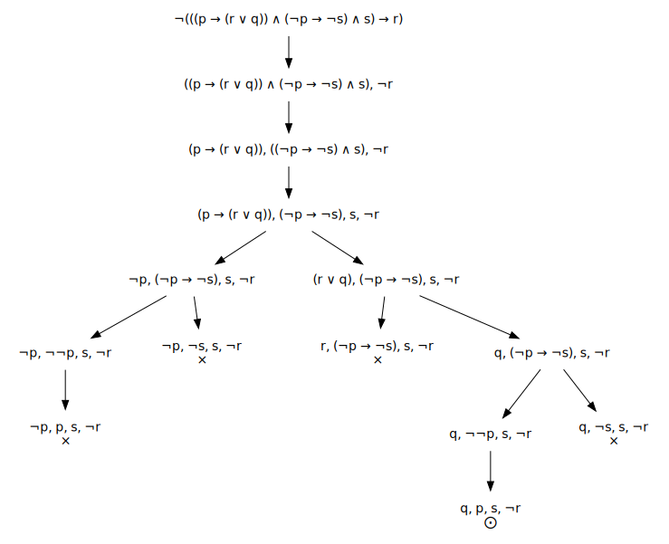

# Resolución en el Cálculo Proposicional

Este repositorio contiene el código de un programa de terminal diseñado para resolver problemas de lógica proposicional. Concretamente, construcción de **tableros semanticos** y **resolución** de expresiones de lógica proposicional.

## Motivación

Los problemas que intenta resolver este programa son problemas planteados en el Tema 1 de la asignatura [Conocimiento y Razonamiento Automatizado](https://www.uah.es/es/estudios/estudios-oficiales/grados/asignatura/Conocimiento-y-Razonamiento-Automatizado-780025/) del tercer curso del [Grado en Ingeniería Informática](https://www.uah.es/es/estudios/Grado-en-Ingenieria-Informatica/) de la [Universidad de Alcalá](https://www.uah.es/es/). Así pues, este programa intenta facilitar el estudio de esta asignatura proporcionando una herramienta para encontrar las soluciones de los problemas de manera consistente.

## Instalación

Este repositorio es un proyecto de [IntelliJ IDEA](https://www.jetbrains.com/es-es/idea/). Este tiene configurado un artefacto para crear un fichero **jar** que pueda utilizarse para ejecutar el programa. Se puede encontrar el fichero compilado para distintas versiones del jdk en el apartado de **releases** del repositorio.

### Compilación

Para compilarlo es necesario tener en la carpeta de dependencias el .jar con la librería [ANTLR v4](https://www.antlr.org/). La versión con la que se han creado los ficheros de la gramática es la **4.11.1** por lo que el fichero necesario sería [antlr-runtime-4.11.1.jar](https://www.antlr.org/download/antlr-runtime-4.11.1.jar). Sin embargo, es posible hacer que el programa funcione con otras versiones de [ANTLR v4](https://www.antlr.org/) siempre y cuando se vuelvan a generar los archivos de código a partir de la gramática en el paquete **calcprop.interpreter** del proyecto.

Una vez tenemos el código del programa y las dependencias correspondientes podemos compilarlo desde el menú `Build > Build Artifact... > SemanticTables:jar Build`. También se puede encontrar el fichero compilado para distintas versiones del jdk en el apartado de **releases** del repositorio.

### Programas necesarios

Además del fichero compilado, para algunas opciones del programa se necesitará tener instalado y en el PATH el programa [GraphViz](https://graphviz.org/). Este programa se utiliza para generar imagenes vectoriales de los tableros semánticos.

## Uso

Para utilizar el programa desde la terminal escribiremos algo similar a lo siguiente:

```bash
java -jar RCP-XX.jar <modo> <archivo>
```

En el anterior comando:

- `<modo>`. Puede tomar uno de los siguientes valores: `tablero-semantico`, `resolucion`.
- `<archivo>`. Es la ruta del archivo que contiene la formula a procesar.

El archivo que debemos pasar como segundo argumento al programa deberá contener una expresión de lógica proposicional utilizando los siguientes operadores:

- `¬`. Operador NOT.
- `∨`. Operador OR.
- `∧`. Operador AND.
- `→`. Operador Condicional.
- `↔`. Operador Bicondicional.
- `⊕`. Operador XOR.
- `|`. Operador NAND.
- `↓`. Operador NOR.

También se permite el uso de paréntesis para agrupar expresiones y `;` para crear comentarios de línea.

El programa solamente aceptará una expresión por archivo por lo que en el siguiente fichero de ejemplo solamente se procesará la primera de las dos expresiones:

```
¬(((p → (r ∨ q)) ∧ (¬p → ¬s) ∧ s) → r)
¬(((p → q) → r) → (q → r))
```

Si pasamos el fichero [test.cp](./src/test.cp) como argumento obtendremos las siguientes salidas para los dos modos del programa:

### Tablero semántico

```bash
java -jar RCP-XX.jar tablero-semantico test.cp
```

La salida del modo `tablero-semantico` es una imagen con el mismo nombre que el archivo de entrada, y en el mismo directorio, en formato **svg**. Así pues, en este caso la salida del programa sería la imagen [test.cp.svg](./src/test.cp.svg):



Como se puede observar, en el salto de cada nodo al siguiente solamente se aplica una α-regla o una β-regla. Además, las ramas abiertas del árbol terminan con el símbolo `⨀` mientras que las ramas cerradas lo hacen con el símbolo `×`.

### Resolución

```bash
java -jar RCP-XX.jar resolucion test.cp
```

La salida del modo `resolucion` es en forma de texto a través de la salida estándar:

```
Formula: ¬(((p → (r ∨ q)) ∧ (¬p → ¬s) ∧ s) → r)
Forma normal conjuntiva: ((¬p ∨ r ∨ q) ∧ (p ∨ ¬s) ∧ s ∧ ¬r)
Resolucion: 
   1. (¬p ∨ q ∨ r)         
   2. (¬s ∨ p)             
   3. s                    
   4. ¬r                   
   5. (¬s ∨ q ∨ r)         ( 1,  2)
   6. (¬p ∨ q)             ( 1,  4)
   7. p                    ( 2,  3)
   8. (¬s ∨ q)             ( 2,  6)
   9. (q ∨ r)              ( 3,  5)
  10. q                    ( 3,  8)
× 11. (¬s ∨ q)             ( 4,  5) ×  8
× 11. q                    ( 4,  9) × 10
× 11. q                    ( 6,  7) × 10
× 11. (q ∨ r)              ( 1,  7) ×  9
× 11. q                    ( 3, 11) × 10
× 11. (¬s ∨ q)             ( 4,  5) ×  8
× 11. q                    ( 4,  9) × 10
× 11. q                    ( 4, 14) × 10
× 11. q                    ( 6,  7) × 10
```

En el modo de resolución, se transforma la expresión a forma normal conjuntiva y después se inicia la resolución con cada una de las disyunciones como un paso numerado. Los siguientes pasos indican a la derecha a partir de que otros dos pasos se han obtenido. Además, si un paso devuelve una expresión que ya se había obtenido, el paso al completo estará rodeado por el símbolo `×` y se indicará a la derecha el anterior paso que tiene la misma expresión.

## Contribuir

En este momento, es posible que el programa tenga algunos errores de menor importancia. Esto se debe a que el programa se hizo en un corto lapso de tiempo y no tiene el código más limpio o eficiente. Puedes dejar un **issue** explicando cualquier error que te hayas encontrado de manera que quede documentado y así pueda arreglarlo. Si prefieres lanzarte a la aventura y arreglar tú los problemas que encuentres, te invito a crear un **fork** del repositorio y modificarlo como te plazca. Una vez hayas llevado a cabo los cambios que consideres si quieres que estos formen parte del repositorio siéntete libre de hacer un **pull request** para que los incluya.
